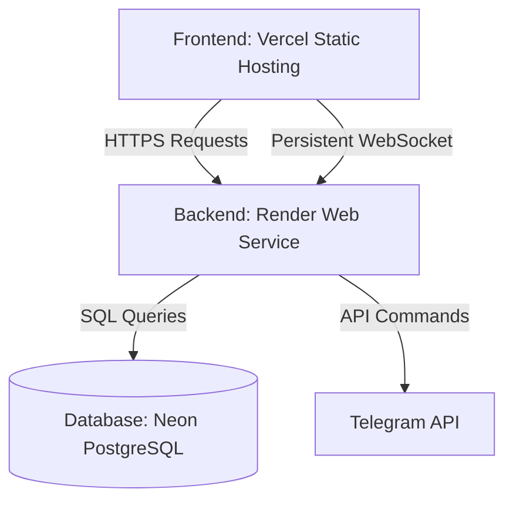

# Production Deployment Guide: Vercel + Render + Neon

This guide outlines how to deploy the **AGY-Trader** system to production with a decoupled architecture.

## Architecture Map



---

## 1. Database Setup (Neon PostgreSQL)
1. Log in to [Neon Console](https://neon.tech).
2. Create a new Project.
3. Retrieve your **Connection String** (`DATABASE_URL`) from the Neon dashboard.
4. Run the schema query inside your database console using the contents of `schema.sql` to initialize all 15 required tables.

---

## 2. Backend Deployment (Render Web Service)
The backend is configured to deploy directly using the `render.yaml` blueprint.

1. Create a new service on [Render](https://render.com) using the GitHub repository.
2. Render will automatically detect the `render.yaml` configuration.
3. Fill in the following environment variables in the Render Dashboard under **Environment**:
   * `DATABASE_URL`: Your Neon Connection String.
   * `NODE_ENV`: `production`
   * `GEMINI_API_KEY`: Google Gemini API Key.
   * `GROQ_API_KEY`: Groq API Key (Optional).
   * `ADMIN_PASSWORD`: Admin password for control panel resets.
   * `TELEGRAM_BOT_TOKEN`: Your Telegram Bot API token.
   * `TELEGRAM_CHAT_ID`: Your Telegram group/private chat ID.

---

## 3. Frontend Deployment (Vercel)
The frontend dashboard consists of static HTML, CSS, and JS assets (`index.html`, `dashboard.js`, `style.css`, etc.) deployable to Vercel.

1. Create a new project on [Vercel](https://vercel.com).
2. Link the same GitHub repository.
3. Configure the **Build Command** on Vercel:
   ```bash
   npm run build
   ```
4. Set the following build-time environment variables in Vercel:
   * `API_BASE_URL`: `https://your-backend-url.onrender.com` (Your deployed Render backend URL)
   * `WS_BASE_URL`: `wss://your-backend-url.onrender.com` (Your deployed Render WebSocket URL)
5. Deploy! Vercel will build the frontend assets, replacing placeholder URLs with your active backend production endpoints.
